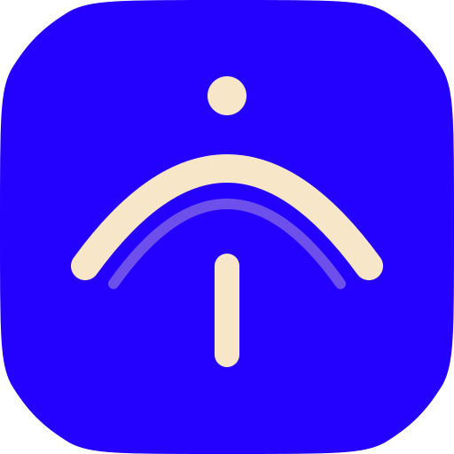

# crane — UI design (simple rules)

<p align="center">
  
</p>

This is crane’s design cheat sheet. Keep the app **quiet, fast, and Mac-native**.

Inspired by [UI Design Brain](https://component.gallery) patterns, adapted for a menu-bar + floating panel app.

---

## The one sentence test

> *Can someone capture a thought in 2 seconds without thinking about the UI?*

If not, simplify.

---

## Three surfaces

| Surface | What it is | Job |
|---------|------------|-----|
| **Capture bar** | Floating pill (⌘⇧Space) | Type → Enter → gone |
| **History** | Same panel, taller | Find old entries |
| **Dashboard** | Menu-bar popover | Glance + Write + Quit |

Same data everywhere. Same look and feel.

---

## Visual rules

### 1. Less on screen

- Hide delete buttons until hover
- One blue **Write** button per footer — that’s the accent
- No extra borders, shadows, or decoration “just because”

### 2. Space = groups

- Use the **8px grid** (`DesignMetrics` in `Design.swift`)
- **20px** side padding on the overlay
- **16px** on the dashboard
- More space between sections than between lines in a row

### 3. Type tells you what matters

| Role | Font | Size |
|------|------|------|
| Capture field | Instrument Serif | 26 |
| Titles | Instrument Serif | 20 |
| Section headers | Instrument Serif | 17 |
| Body / rows | Geist | 14 |
| Meta / hints | Geist | 12 |

Use `.craneText(.body)` etc. — don’t invent new sizes.

### 4. One accent color

- **Blue** = Write / primary action only
- **Sage** = tags and soft highlights
- **Link blue** = links only
- Everything else = cream / ink grays

### 5. Glass, not gray boxes

- Shell = **Liquid Glass** (rounded, 22px corners)
- Inputs inside glass = flat **recess fill** (6% ink), not more glass
- Thin **specular edge** on overlay + dashboard so panels feel real

---

## Interaction rules

| Pattern | Rule |
|---------|------|
| **Buttons** | Verbs: “Write”, “Delete All”, not “OK” |
| **Hover** | Spring animation (~0.22s). Row highlight fades in |
| **Focus** | Visible ring on search + capture field |
| **Empty state** | Icon + short line + one action (“Write”) |
| **Delete** | Always ask first. Destructive = warning color |
| **Keyboard** | Every action should have a shortcut in the **Capture** menu |

---

## Components we use

| UI piece | crane file | Keep in mind |
|----------|------------|--------------|
| Capture input | `ContentView.swift` | Field focused on open |
| Search | `HistoryView.swift` | ⌘F, debounced |
| List rows | `DropRow.swift` | Hover to show actions |
| Tags | `TagChip.swift` | Pill shape, sage fill |
| Empty state | `EmptyStateView.swift` | Friendly, not sad |
| Primary button | `CraneButtonStyles.swift` | One per area |
| Section title | `CraneSectionHeader.swift` | Journal = serif |

---

## Don’t do this

- Purple gradients or “AI app” look
- Tiny text under 12px for important UI
- Buttons that all look equally important
- Delete icons always visible on every row
- Mixing 12 / 16 / 18px padding randomly
- ⌘H for history (conflicts with **Hide** — use **⌘⇧H**)
- Alerts that close the menu-bar window (use inline confirm instead)

---

## Before you change UI

1. Read `Design.swift` tokens first
2. Reuse `CraneTextStyle`, `CraneColor`, `DesignMetrics`
3. Check light **and** dark asset colors (app defaults to dark)
4. Test: capture → save → dashboard updates live

---

## Files to edit

```
crane/Design.swift           — spacing, motion, glass, borders
crane/CraneColors.swift      — colors
crane/CraneTypography.swift  — fonts + .craneText()
crane/CraneButtonStyles.swift — buttons
```

When in doubt: **remove something**, don’t add something.
